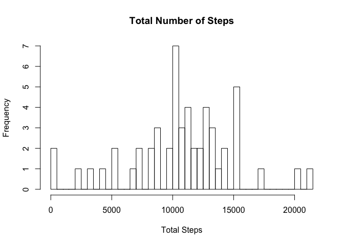
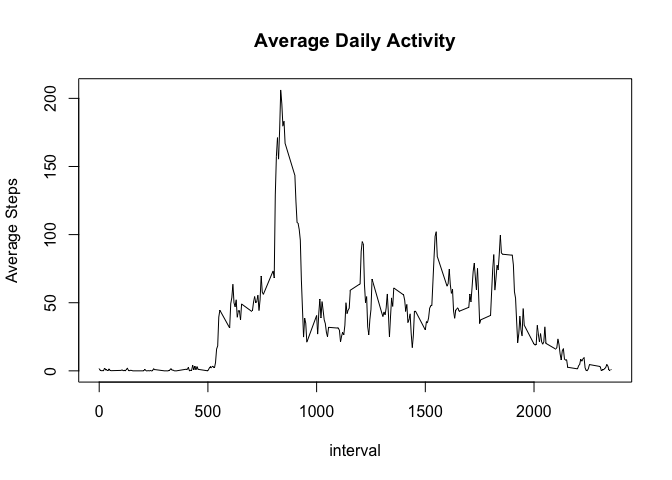
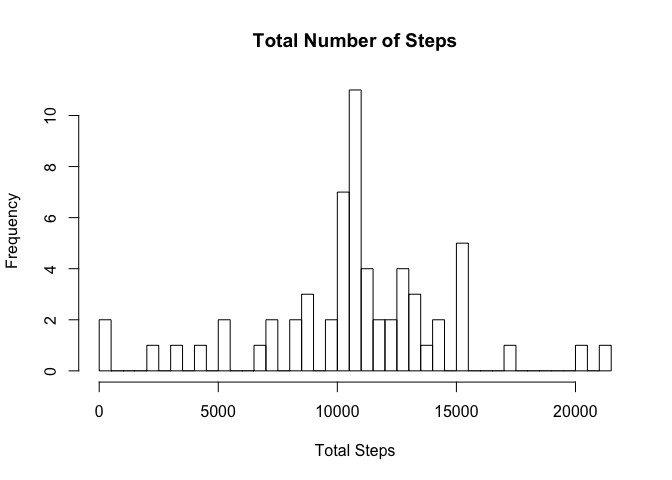
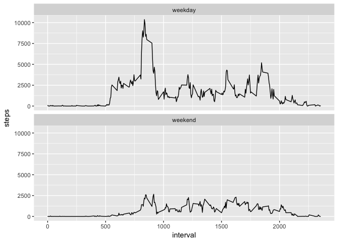

# Untitled
Erica Trinh  
September 18, 2017  
output: github_document


## Loading and preprocessing the data


```r
file <- "https://d396qusza40orc.cloudfront.net/repdata%2Fdata%2Factivity.zip"
download.file(file, "/Users/ericatrinh/reproducibleResearchProject1/monitoringData.zip", method="curl")
unzip("/Users/ericatrinh/reproducibleResearchProject1/monitoringData.zip")
activity <- read.csv( "/Users/ericatrinh/reproducibleResearchProject1/activity.csv", header = TRUE)
activity$date <- as.Date( activity$date, format = "%Y-%m-%d") 
```

## What is the average daily activity pattern?


```r
data <- activity[ !is.na(activity$steps), ]
totalSteps <- tapply(data$steps, data$date, FUN = sum)
hist(totalSteps, breaks = length(totalSteps), main = "Total Number of Steps", xlab = "Total Steps")
```

<!-- -->

```r
mean(totalSteps, na.rm = TRUE) 
```

```
## [1] 10766.19
```

```r
median(totalSteps, na.rm = TRUE)
```

```
## [1] 10765
```

##What is the average daily activity pattern?

```r
meanSteps <- tapply(data$steps, data$interval, FUN = mean)
plot(names(meanSteps), meanSteps, type = "l", main = "Average Daily Activity", xlab = "interval" , ylab = "Average Steps" )
```

<!-- -->

```r
names(meanSteps)[match(max(meanSteps), meanSteps)]
```

```
## [1] "835"
```


## Imputing missing values

```r
nrow( activity[ is.na(activity$steps), ] )
```

```
## [1] 2304
```

```r
fill <- as.data.frame( cbind( names(meanSteps), meanSteps) )
fill$meanSteps <- as.numeric(as.character(fill$meanSteps))
# fills in missing data
for( i in 1:nrow(activity) ){
    if( is.na(activity$steps[i]) ){
        activity[i,1] <- round( fill[match(activity$interval[i],fill[,1]),2] )
    }
}
totalSteps <- tapply(activity$steps, activity$date, FUN = sum)
hist(totalSteps, breaks = length(totalSteps), main = "Total Number of Steps", xlab = "Total Steps")
```

<!-- -->

```r
mean(totalSteps, na.rm = TRUE) 
```

```
## [1] 10765.64
```

```r
median(totalSteps, na.rm = TRUE)
```

```
## [1] 10762
```

##Are there differences in activity patterns between weekdays and weekends?

```r
require(ggplot2)
```

```
## Loading required package: ggplot2
```

```r
weekday <- c("Monday", "Tuesday", "Wednesday", "Thursday", "Friday")
weekend <- c("Saturday", "Sunday")
activity<- cbind( activity, Day = weekdays(activity$date) )
levels(activity$Day)[levels(activity$Day) %in% weekday ] <- "weekday"
levels(activity$Day)[levels(activity$Day) %in% weekend ] <- "weekend"
data <- aggregate(steps ~ interval + Day ,activity, FUN = sum )
ggplot( data, aes(interval, steps)) +  geom_line() + facet_wrap(~Day, 2)
```

<!-- -->
